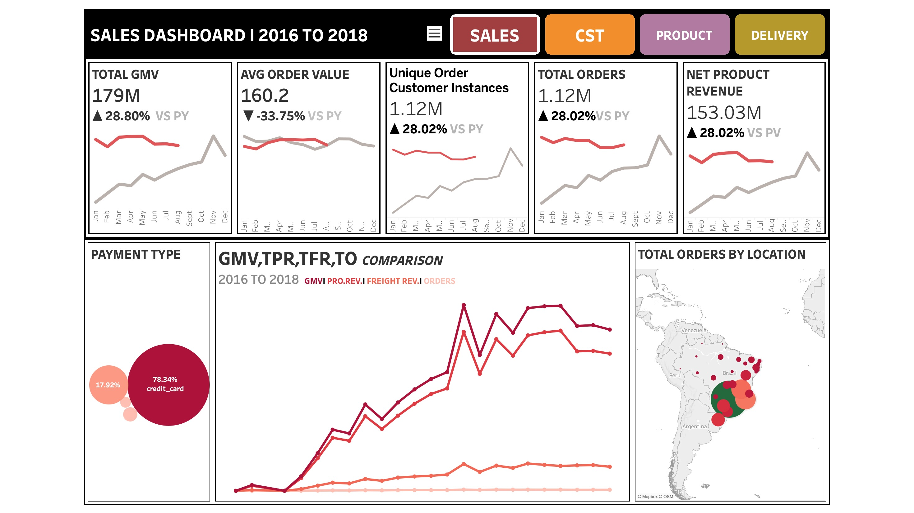
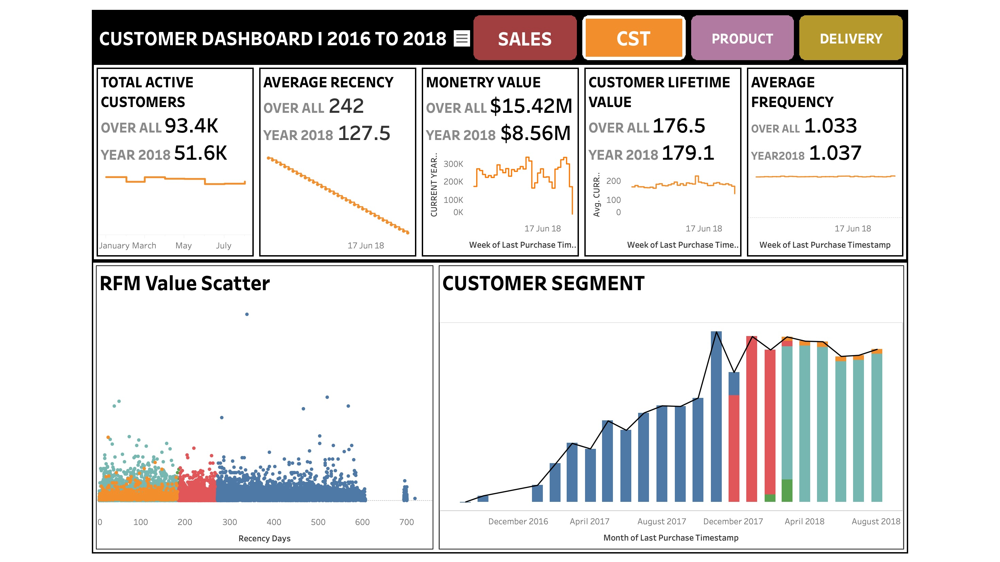
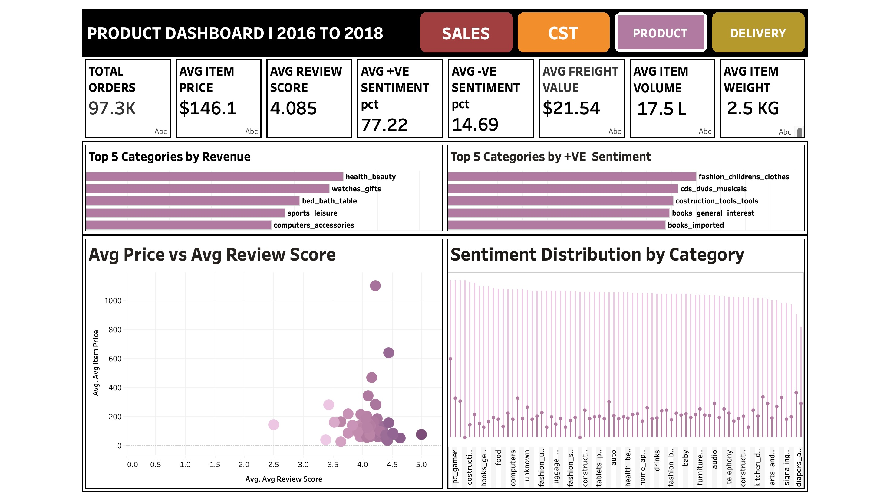
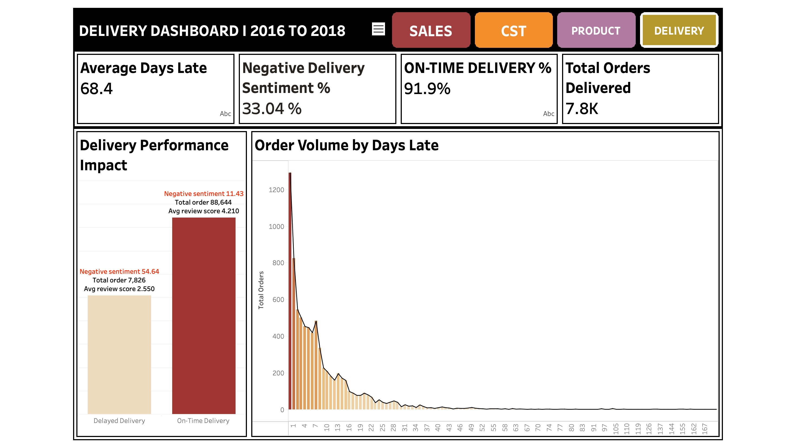

# 🛒 End-to-End E-Commerce Data Pipeline & Executive BI Suite (Olist Dataset)

An enterprise-grade, modern data stack project built using **Snowflake (Medallion Architecture)** and visualized via an **Executive BI Dashboard Suite**. This project processes the Brazilian Olist e-commerce database, transforming raw, messy logs into clean analytical models and tracking **$179M in Gross Merchandise Value (GMV)**.

---

## 🏗️ Architecture & Data Flow
The pipeline follows the industry-standard **Medallion Architecture** pattern inside Snowflake:
1. **Bronze Layer:** Raw data ingestion with initial volume, null, and structural integrity checks (`TRY_CAST` / `TRY_TO_TIMESTAMP`).
2. **Silver Layer:** Data cleaning, type casting, text normalization (`INITCAP`, `TRIM`), and handling missing categories/geolocations.
3. **Gold Layer:** Dimensional modeling (Star Schema) consisting of conformed dimensions (`dim_date`, `dim_customer`, `dim_product`, `dim_seller`) and granular facts (`fact_orders`, `fact_payments`, `fact_reviews`).
4. **Analytical Serving Layer:** Tailored SQL views powering advanced analytics, RFM customer segmentation, and logistics SLA performance.

---

## 📊 Executive Dashboard Preview
The analytical views feed a multi-tab executive suite covering four core business domains:

* **Sales Dashboard:** Tracks financial performance (**$179M GMV**, **$153M Net Product Revenue**), payment behavior (78.3% credit card preference), and geographic order density.
  

* **Customer Dashboard:** Evaluates active user growth (**93.4K total customers**), lifetime values, and automated **RFM Customer Segmentation** using Snowflake window functions (`NTILE`).
  

* **Product Dashboard:** Analyzes top revenue categories (*health_beauty*, *watches_gifts*), average item pricing, and sentiment distributions.
  

* **Delivery Dashboard:** Monitors operational health, spotlighting an overall **91.9% On-Time Delivery rate** and correlating delivery delays with customer review sentiment drops.
  

---

## 🛠️ Technical Highlights & Engineering Practices
* **Defensive Pipeline Engineering:** Leveraged Snowflake's `TRY_CAST` and `TRY_TO_TIMESTAMP` functions to ensure zero pipeline failures caused by data type mismatches or corrupt timestamps.
* **Advanced Window Functions:** Implemented RFM (Recency, Frequency, Monetary) scoring models using `NTILE(5)` window analytics to segment customer behavior dynamically.
* **Logistics SLA Tracking:** Built automated variance checks comparing customer purchase timestamps, estimated delivery schedules, and actual delivery dates to flag logistical bottlenecks.

---

## 📂 Repository Structure
```text
olist-snowflake-medallion-analytics/
│
├── ASSETS/                          # Dashboard screenshots
│   ├── SALES_DASHBOARD.jpeg
│   ├── CUSTOMER_DASHBOARD.jpeg
│   ├── PRODUCT_DASHBOARD.jpeg
│   └── DELIVERY_DASHBOARD.jpeg
│
├── sql/                             # Modular SQL execution scripts
│   ├── OLIST_EDA.sql
│   ├── OLIST_DATABASE AND BRONZE.sql
│   ├── OLIST_SILVER_LAYER.sql
│   ├── OLIST_GOLD_LAYER.sql
│   └── OLIST_ANALYTICAL_LAYER.sql
│
└── README.md
